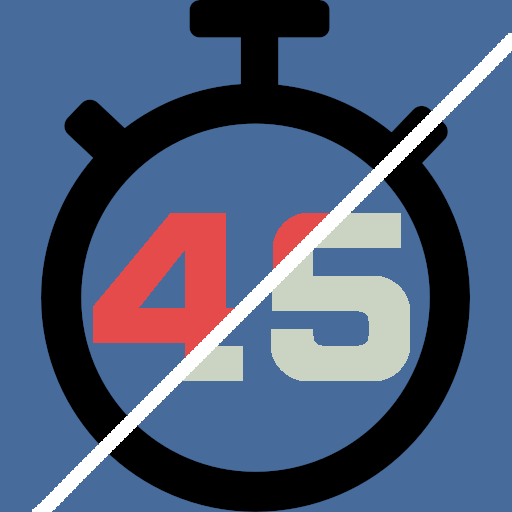
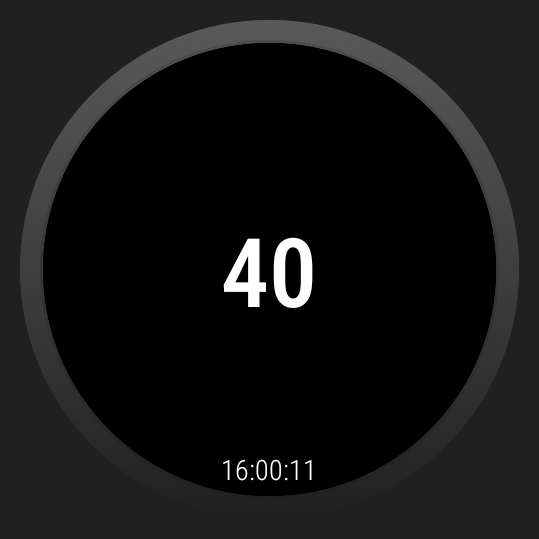
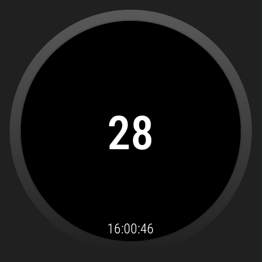
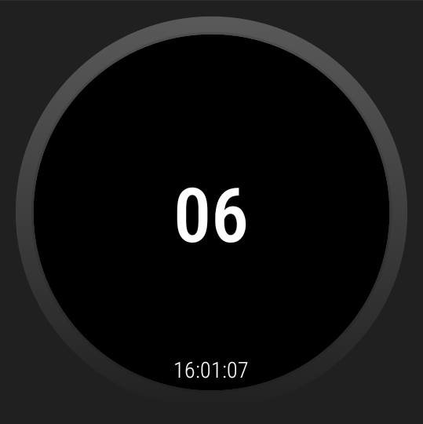

# FootballPlayclockWatchOS

Kurz: Eine Android-App (Gradle-Projekt), die eine Play-Clock für Football anzeigt. Dieses Repository enthält eine einfache UI, Grafiken und die nötige Android-Projektstruktur.

## Ansicht
Die Ansicht ist äußerst schlicht gehalten um wunnötige Ablenkungen zu vermeiden.

Da die Pixel Watch Serie keine Hardware Buttons mehr nutzt, verwendet die App einen Gesture Detector um einfache Aktionen zu erkennen. 

## Start der Playclok

Bei einem Doppelklick auf den Bildschirm der Uhr startet die Uhr einen 40 Sekunden Timer. 
Bei einem Wischen nach oben oder nach unten startet die Uhr einen 25 Sekunden Timer. 
Beides wird durch eine Vibration der Uhr quittiert. 

Erreicht der Timer 25 Sekunden (beim setzen auf 40) vibriert die Uhr kurz (200 ms) um den Schiedsrichter zur Kommunikation mit dem Referee hinzuweisen.
Bei 15 Sekunden vibriert die Uhr etwas länger (400ms) um das fortschreiten mitzuteilen.
Bei 10 Sekunden vibriert die Uhr im ersten Muster (400ms - 200 ms - 400 ms) um darauf hinzuweisen ggf. den Arm zu heben.
Bei 5 Sekunden beginnt die Uhr bis 0 Sekunden ein schnelles Muster von sich zu geben (200 ms - 200 ms - 200 ms). 
Bei 0 Sekunden bleibt die Uhr stehen und ein langes Muster (400ms - 200ms - 400ms - 200ms - 400ms) vibriert.

## Sonstiges

Damit die App auch beendet werden kann, ist beim langen halten des Bildschirms ein Menü integriert. 
